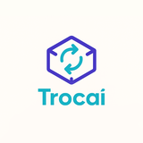

 

  
  
  
  

  

<picture>
  <source media="(prefers-color-scheme: dark)" srcset="https://raw.githubusercontent.com/degabrielofi/degabrielofi/output/github-contribution-grid-snake-dark.svg" />
  <source media="(prefers-color-scheme: light)" srcset="https://raw.githubusercontent.com/degabrielofi/degabrielofi/output/github-contribution-grid-snake.svg" />
  
</picture>

 

  

## 🧭 Who I Am

I'm a **founder-engineer** — I don't separate business from technology.
I architect systems, build products, and operate companies at the same time.

`idea` → `architecture` → `product` → `monetization` → `scale`

Currently leading **Guebly**, a technology holding spanning fintech, accounting, entertainment,
security, and creative ventures. Every company in the portfolio has been built from scratch —
brand, architecture, and business model included.

 

  

## 🏢 The Ecosystem

<table>
  <tr>
    <td width="33%" valign="top" align="center">
      
      <h3>Guebly</h3>
      Technology, branding &amp; automation hub — the operation behind every company below.
        
      <b>Technology · Branding · Automation</b>
    </td>
    <td width="33%" valign="top" align="center">
      
      <h3>Guebly Pay</h3>
      Payment gateway for the whole ecosystem — PIX, boleto, card, and payouts with real security controls.
        
      <b>Payments · Fintech</b>
    </td>
    <td width="33%" valign="top" align="center">
      
      <h3>Guebly Contábil</h3>
      Digital accounting for MEIs and small businesses, with fiscal and financial automation baked in.
        
      <b>Accounting · BPO · Fiscal</b>
    </td>
  </tr>
  <tr>
    <td width="33%" valign="top" align="center">
      
      <h3>Guebly Studio</h3>
      Branding, technology and automation studio — websites, systems, APIs and bots, concept to code.
        
      <b>Branding · Systems · Automation</b>
    </td>
    <td width="33%" valign="top" align="center">
      
      <h3>Sentrion</h3>
      Security solutions powered by computer vision and AI — smart-camera monitoring and integrated alarms.
        
      <b>Security · AI · IoT</b>
    </td>
    <td width="33%" valign="top" align="center">
      
      <h3>Lirya</h3>
      Education, entertainment and streaming ecosystem — Lirya Studios, Lirya+ and Lirya Academy.
        
      <b>Education · Streaming · Entertainment</b>
    </td>
  </tr>
  <tr>
    <td width="33%" valign="top" align="center">
      
      <h3>Trocaí</h3>
      Used-goods marketplace with the lowest fees on the market, payments handled natively by Guebly Pay.
        
      <b>Marketplace · Used Goods</b>
    </td>
    <td width="33%" valign="top" align="center">
      
      <h3>Guebly Games</h3>
      Digital games studio blending technology and narrative into immersive experiences.
        
      <b>Games · Immersion</b>
    </td>
    <td width="33%" valign="top"></td>
  </tr>
</table>

→ [**guebly.com.br**](https://www.guebly.com.br) — full ecosystem overview

 

  

## 🧠 Core Expertise

<table>
<tr>
<td width="50%" valign="top">

**🏗 Architecture & Product**
- System design built around real business outcomes
- SaaS & multi-tenant platforms at scale
- Payments, subscriptions & billing systems
- RBAC, Auth (JWT + MFA), security-first design
- Business-driven technical decisions — no over-engineering

</td>
<td width="50%" valign="top">

**⚙️ Backend & Infra**
- NestJS · Node.js · FastAPI · Python · Go
- REST APIs, Webhooks, event-driven architecture
- PostgreSQL · Redis · Prisma ORM · SQLAlchemy
- Docker · self-hosted infra · CI/CD (GitHub Actions)
- Cloudflare · Neon (serverless Postgres)

</td>
</tr>
<tr>
<td width="50%" valign="top">

**🖥 Frontend & Mobile**
- React 19 · TypeScript · Vite
- React Native · Expo
- MUI · Tailwind CSS · Styled-components · Design tokens
- Design → production without handoff friction

</td>
<td width="50%" valign="top">

**🔐 Security & Ops**
- Fraud detection & risk scoring engines
- Encryption at rest, timing-safe auth, SSRF hardening
- Automated payout & reconciliation pipelines
- Multi-service orchestration across a self-hosted fleet

</td>
</tr>
</table>

 

  

## 🛠 Tech Stack

 

  

## 📊 GitHub Stats

  
  

  

 

  

**Open to strategic conversations — partnerships, ventures, and hard problems.**

📬 [gabriel@guebly.com.br](mailto:gabriel@guebly.com.br) · [LinkedIn](https://www.linkedin.com/in/degabrielofi/) · [Instagram](https://www.instagram.com/degabrielofi/) · [guebly.com.br](https://www.guebly.com.br)

