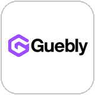
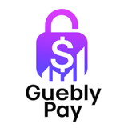
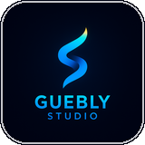
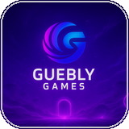

  

<h1 align="center">Gabriel Pereira</h1>

<b>Founder &amp; CEO, Guebly</b> — projeto, construo e opero cada empresa do grupo, do zero.

  <a href="mailto:gabriel@guebly.com.br">gabriel@guebly.com.br</a> ·
  <a href="https://www.linkedin.com/in/degabrielofi/">LinkedIn</a> ·
  <a href="https://www.instagram.com/degabrielofi/">Instagram</a> ·
  <a href="https://www.guebly.com.br">guebly.com.br</a>

 

Não separo o lado técnico do lado de negócio: a arquitetura de um sistema e o
modelo de receita por trás dele nascem juntos, na mesma decisão. Hoje isso
significa liderar a Guebly — uma holding com sete frentes, cada uma com marca,
arquitetura e modelo de negócio próprios, sem fundo externo.

 

## O ecossistema

<table>
  <tr>
    <td width="33%" valign="top">
      
      
<b>Guebly</b> 
      Tecnologia, branding e automação — a operação por trás de todas as empresas abaixo.

    </td>
    <td width="33%" valign="top">
      
      
<b>Guebly Pay</b> 
      Gateway de pagamentos do grupo — PIX, boleto, cartão e repasses.

    </td>
    <td width="33%" valign="top">
      
      
<b>Guebly Contábil</b> 
      Contabilidade digital para MEIs e pequenos negócios, com automação fiscal.

    </td>
  </tr>
  <tr>
    <td width="33%" valign="top">
      
      
<b>Guebly Studio</b> 
      Estúdio de branding e automação — sites, sistemas, APIs e bots, do conceito ao código.

    </td>
    <td width="33%" valign="top">
      
      
<b>Sentrion</b> 
      Segurança com visão computacional — câmeras inteligentes e alarmes integrados.

    </td>
    <td width="33%" valign="top">
      
      
<b>Lirya</b> 
      Educação, entretenimento e streaming — Lirya Studios, Lirya+ e Lirya Academy.

    </td>
  </tr>
  <tr>
    <td width="33%" valign="top">
      
      
<b>Guebly Games</b> 
      Estúdio de jogos digitais — tecnologia e narrativa em experiências imersivas.

    </td>
  </tr>
</table>

→ <a href="https://www.guebly.com.br/produtos">guebly.com.br/produtos</a> lista os SaaS que cada uma dessas empresas mantém.

  

## Como eu trabalho

**Arquitetura & produto** — desenho de sistema puxado por resultado de negócio, não por moda técnica. SaaS multi-tenant em escala, cobrança e assinatura, autenticação e RBAC pensados como parte do produto, não como camada extra.

**Backend & infra** — NestJS, Node, FastAPI, Python, Go. APIs REST e webhooks, PostgreSQL, Redis, Prisma. Frota própria em Docker, autogerida — sem depender de nuvem de terceiro pra decisão de arquitetura.

**Frontend** — React, TypeScript, React Native. Levo o design até produção eu mesmo; não existe entrega "pronta pro dev implementar depois".

**Segurança & operação** — detecção de fraude, criptografia em repouso, pipelines de conciliação automática. É a parte que não aparece na demo e é a que decide se o sistema aguenta produção.

 

## Números de agora

  
  

 

  <picture>
    <source media="(prefers-color-scheme: dark)" srcset="https://raw.githubusercontent.com/degabrielofi/degabrielofi/output/github-contribution-grid-snake-dark.svg" />
    <source media="(prefers-color-scheme: light)" srcset="https://raw.githubusercontent.com/degabrielofi/degabrielofi/output/github-contribution-grid-snake.svg" />
    
  </picture>

 

Aberto a conversa sobre parceria, investimento e problema difícil de resolver.

